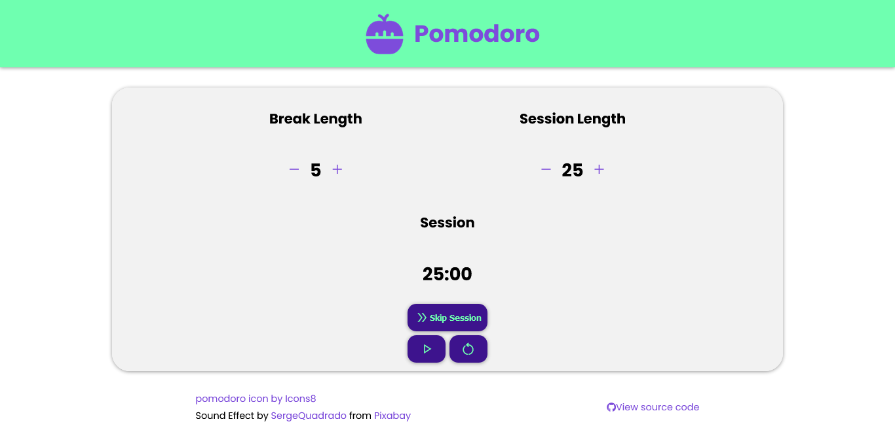

#  Pomodoro

Get more done and increase your productivity with our Pomodoro Timer web app! Based on the Pomodoro Technique, this timer helps you break down your work into focused 25-minute sessions with 5-minute breaks in between. Improve your focus, eliminate distractions, and boost your productivity with this simple and effective tool. 

A **Typescript-React** app, A _FreeCodeCamp_ challenge.

Status: Deployed. [view live web app](https://moharamfatema.github.io/pomodoro/)

Used tools and frameworks:

-   

-   

Linting:

-   

-   

Color theme:

-   <a href="https://v2.grommet.io/color" target="_blank" rel="noreferrer"> <svg aria-label="Grommet" viewBox="0 0 24 24" class="StyledIcon-sc-ofa7kd-0 kszogF" width="40" height="40"><path fill="none" stroke="#865CD6" stroke-width="4" d="M12 2C6.485 2 2 6.485 2 12s4.485 10 10 10 10-4.485 10-10S17.515 2 12 2z"></path></svg> </a>

## Screenshots

